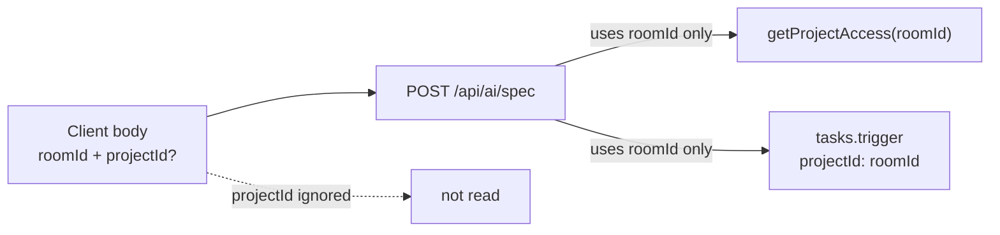

# Harden AI Spec Route Tests Against Body projectId Spoofing

## Verification Result

**Finding is still valid.** Current production code in [`app/api/ai/spec/route.ts`](../app/api/ai/spec/route.ts) already enforces the correct behavior:

```ts
// roomId IS the projectId in this system — never trust a client-supplied projectId
const access = await getProjectAccess(roomId)
...
handle = await tasks.trigger('generate-spec', {
  projectId: roomId,
  roomId,
  chatHistory,
  nodes,
  edges,
})
```

The handler destructures only `{ roomId, chatHistory, nodes, edges }` from the body — `projectId` is never read. **No production code change needed.**

**Tests were insufficient.** Two test blocks documented intent but did not send an attacker-controlled `projectId` in the request body.

| Location | Gap | Status |
|----------|-----|--------|
| Lines ~205–212 (`project access check`) | No spoofed `projectId` in body | Fixed |
| Lines ~298–311 (`roomId as projectId`) | No spoofed `projectId` in body | Fixed |

**Skipped (not applicable):**

- Changing the route handler — already correct.
- Changing `getProjectAccess` signature — route calls it with one arg (`roomId`).

## Step 1: Harden Test Block 1 — `getProjectAccess`

In [`__tests__/api/ai/spec/route.test.ts`](../__tests__/api/ai/spec/route.test.ts):

```ts
await POST(makeRequest({
  ...validBody,
  roomId: 'room-abc',
  projectId: 'attacker-project',
}))
expect(mockGetProjectAccess).toHaveBeenCalledWith('room-abc')
expect(mockGetProjectAccess).not.toHaveBeenCalledWith('attacker-project')
expect(mockGetProjectAccess).not.toHaveBeenCalledWith(expect.anything(), expect.anything())
```

## Step 2: Harden Test Block 2 — `tasks.trigger` payload

In the `describe('roomId as projectId')` block:

```ts
await POST(makeRequest({
  ...validBody,
  roomId: 'room-id-is-project-id',
  projectId: 'attacker-project',
}))
expect(mockGetProjectAccess).toHaveBeenCalledWith('room-id-is-project-id')
expect(mockTasksTrigger).toHaveBeenCalledWith('generate-spec', expect.objectContaining({
  projectId: 'room-id-is-project-id',
  roomId: 'room-id-is-project-id',
}))
expect(mockTasksTrigger).not.toHaveBeenCalledWith(
  'generate-spec',
  expect.objectContaining({ projectId: 'attacker-project' }),
)
```

## Step 3: Validate

```bash
npx vitest run __tests__/api/ai/spec/route.test.ts
```

## Step 4: Write Fix Doc

Created [`docs/fixes/fix-ai-spec-route-ignore-body-projectid-tests.md`](../fixes/fix-ai-spec-route-ignore-body-projectid-tests.md)

## Completion Summary

| Task | Status |
|------|--------|
| Harden `getProjectAccess` test with spoofed `body.projectId` | Done |
| Harden `tasks.trigger` test with spoofed `body.projectId` | Done |
| Run vitest (22/22 pass) | Done |
| Fix doc + plan saved | Done |


