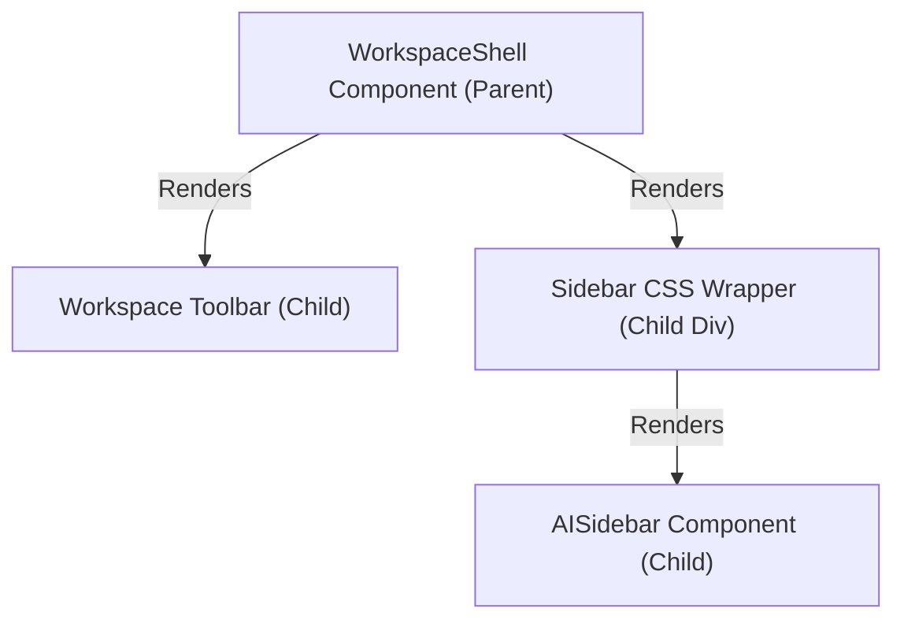
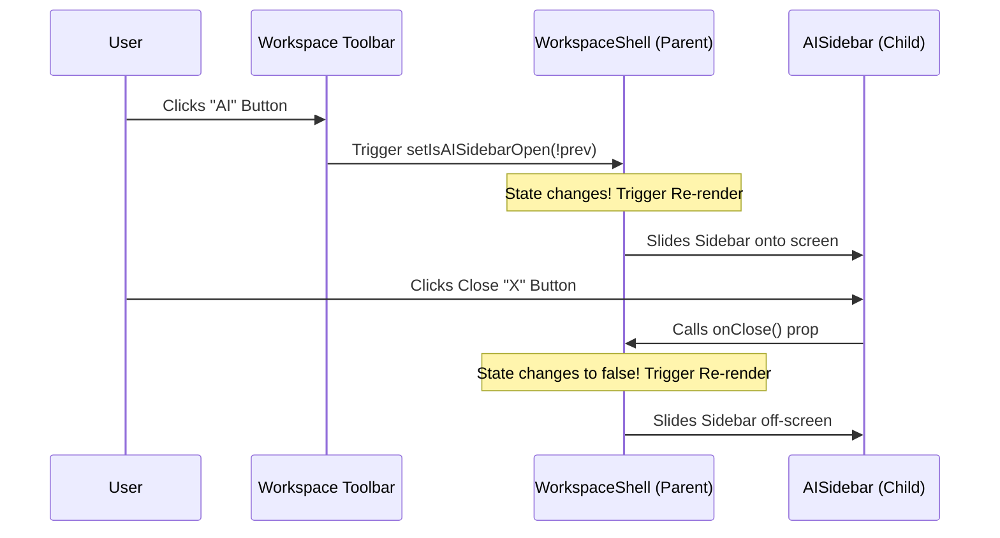

# Interactive Tutorial: React State & CSS Transitions in Sidebar Design

Welcome! This tutorial is designed for beginners to learn the fundamental concepts of React, CSS, and modern web development through the lens of a real-world feature: the **collapsible AI Sidebar** in Ghost AI.

We will break down:
1. **React State & Props**: Why components need memory, and how they talk to each other.
2. **Lifting State Up**: How we decide where a variable should live.
3. **The CSS Layout Model**: How elements position themselves on a screen.
4. **CSS Transitions**: How to animate things smoothly without losing their state.

---

## 1. What is React State? (And why do components need memory?)

Imagine a standard webpage. When you click a button, nothing happens unless you write code to change the page. In traditional web development, you had to manually find an element on the screen and modify it. 

React changes this by introducing **State**. 

> [!NOTE]
> **State** is a component's local memory. It is a special variable that React watches. When the value of a state variable changes, React automatically updates (or "re-renders") the visual layout to match the new value.

### The Code:
In [workspace-shell.tsx](file:///Users/jessejames/Desktop/ghost-ai/my-app-ghost/components/editor/workspace-shell.tsx), we declare the sidebar's open state like this:

```tsx
const [isAISidebarOpen, setIsAISidebarOpen] = useState(true)
```

- `isAISidebarOpen`: The current value (starts as `true`).
- `setIsAISidebarOpen`: A special function used to change that value.

### 💡 Interactive Checkpoint 1
**Question**: Why can't we just write `let isOpen = true;` and change it with `isOpen = false;`?

<details>
<summary><b>Click to reveal the answer</b></summary>

Regular JavaScript variables like `let` do not notify React when they change. React has no way of knowing it needs to redraw the screen. By using `useState`, React is alerted every time `setIsAISidebarOpen` is called, causing it to trigger a re-render of the component and update the UI.
</details>

---

## 2. Lifting State Up (The "Nearest Common Ancestor" Rule)

In React, data flows **downwards** from parent components to child components via **Props** (read-only properties). 

Look at this diagram of our workspace layout:



We have a dilemma:
1. The **Toolbar** contains the "AI" button that toggles the sidebar.
2. The **Sidebar CSS Wrapper** needs to know whether it should slide in or out.
3. The **AISidebar** itself has a close button (`X`) that needs to close the sidebar.

Neither the Toolbar nor the AISidebar can talk to each other directly! 

### The Solution: Lifting State Up
We place the state in their closest common parent: [WorkspaceShell](file:///Users/jessejames/Desktop/ghost-ai/my-app-ghost/components/editor/workspace-shell.tsx). 

- [WorkspaceShell](file:///Users/jessejames/Desktop/ghost-ai/my-app-ghost/components/editor/workspace-shell.tsx) acts as the **source of truth**.
- It passes the state `isAISidebarOpen` down to control the CSS classes.
- It passes a callback function `onClose` down to [AISidebar](file:///Users/jessejames/Desktop/ghost-ai/my-app-ghost/components/editor/ai-sidebar.tsx) so the sidebar can trigger a change in the parent's state.



---

## 3. CSS Layout Basics: Absolute vs. Relative Positioning

To understand how the sidebar sits on the page, we need to look at how CSS places items on a screen.

By default, elements follow the **Normal Flow** (they stack vertically or sit side-by-side like text). However, our editor canvas needs to fill the entire screen, and the toolbar and sidebar need to float on top of it. We achieve this using CSS positioning.

### Relative Positioning (`relative`)
`relative` leaves the element in the normal flow but allows you to anchor absolute children relative to it. [WorkspaceShell](file:///Users/jessejames/Desktop/ghost-ai/my-app-ghost/components/editor/workspace-shell.tsx) uses `relative h-full` to act as the boundary box.

### Absolute Positioning (`absolute`)
`absolute` pulls the element completely out of the normal flow. It no longer takes up space or affects surrounding elements. Instead, it positions itself relative to its nearest `relative` ancestor.

Look at how the components are positioned in [workspace-shell.tsx](file:///Users/jessejames/Desktop/ghost-ai/my-app-ghost/components/editor/workspace-shell.tsx):

```tsx
return (
  <div className="relative h-full">
    {/* 1. Canvas fills the whole background */}
    <div className="absolute inset-0">
      <CanvasWrapper ... />
    </div>

    {/* 2. Toolbar floats along the top */}
    <div className="absolute top-0 left-0 right-0 z-20 h-12 ...">
      ...
    </div>

    {/* 3. Sidebar floats on the right side */}
    <div className="absolute right-0 top-12 bottom-0 z-10 w-80 ...">
      <AISidebar ... />
    </div>
  </div>
)
```

- **Canvas (`inset-0`)**: Stretches to `top: 0, right: 0, bottom: 0, left: 0`. It occupies the entire viewport.
- **Toolbar (`top-0 left-0 right-0 h-12`)**: Anchored to the top, spanning the full width, with a height of 12 (48px).
- **Sidebar (`right-0 top-12 bottom-0 w-80`)**: Anchored to the right side, starting exactly below the toolbar (`top-12` or 48px from the top) and spanning all the way to the bottom (`bottom-0`).

---

## 4. CSS Transitions & React Mounting

How does the open/close slide transition work, and why does always mounting the sidebar matter?

### Method A: Conditional Mounting (The Wrong Way)
In many basic React apps, you might see this:
```tsx
{isAISidebarOpen && <AISidebar />}
```
- **Pros**: Simple code.
- **Cons**: 
  1. No animation: The sidebar instantly pops in or disappears.
  2. **Loss of Memory**: Every time the sidebar is unmounted (removed from the DOM), React throws away its state. If a user has a long chat session with the AI and closes the sidebar, their entire conversation history is wiped out!

### Method B: Slide Transforms (The Right Way)
Instead, we keep the sidebar **always mounted** in the DOM and use CSS transforms to move it out of sight:

```tsx
<div
  className={cn(
    "absolute right-0 top-12 bottom-0 z-10 w-80 transition-transform duration-300 ease-in-out",
    isAISidebarOpen ? "translate-x-0" : "translate-x-full",
  )}
>
  <AISidebar onClose={() => setIsAISidebarOpen(false)} />
</div>
```

- **`translate-x-full`**: Moves the element to the right by 100% of its own width. Because the sidebar is aligned to the right-edge (`right-0`), this shifts it entirely off the right side of the screen, rendering it invisible without unmounting it.
- **`translate-x-0`**: Moves it back to its default position on the screen.
- **`transition-transform`**: Tells the browser to smoothly animate changes to the transform property over `300ms` with an `ease-in-out` speed curve.

> [!TIP]
> **Performance Tip**: Modifying layout properties like `width`, `margin`, or `left/right` causes the browser to recalculate the entire page layout (called **reflow**), which is slow and stuttery. Modifying `transform: translate()` runs on the GPU, yielding silky-smooth 60fps animations.

---

## 5. Interactive Sandbox Exercises

To cement these concepts, run the development server (`npm run dev`) and try making these small code edits to observe the behavior:

### Exercise 1: Break the State Lift
1. Go to [workspace-shell.tsx](file:///Users/jessejames/Desktop/ghost-ai/my-app-ghost/components/editor/workspace-shell.tsx).
2. Change the render block for the sidebar to conditionally render:
   ```diff
   - <div className={cn("absolute right-0 ...", isAISidebarOpen ? "translate-x-0" : "translate-x-full")}>
   -   <AISidebar onClose={() => setIsAISidebarOpen(false)} />
   - </div>
   + {isAISidebarOpen && (
   +   <div className="absolute right-0 top-12 bottom-0 z-10 w-80">
   +     <AISidebar onClose={() => setIsAISidebarOpen(false)} />
   +   </div>
   + )}
   ```
3. Open the sidebar in your browser, type a few letters in the AI Architect chat input, then click the "AI" toggle button to close it and open it again.
4. **Observation**: Notice how your typed letters disappeared? That's because the component was unmounted and its memory was cleared.

### Exercise 2: Change Animation Styles
1. Restore the original code from Exercise 1.
2. Let's make the sidebar slide in from the top instead of the right side.
3. Edit the translation classes:
   ```diff
   - isAISidebarOpen ? "translate-x-0" : "translate-x-full"
   + isAISidebarOpen ? "translate-y-0" : "-translate-y-full"
   ```
4. Toggle the sidebar. It now slides in from above the viewport!

---

## 6. Review Quiz

Test your understanding of the concepts covered in this guide.

#### Q1: What happens to a React component's state when it is unmounted?
<details>
<summary><b>Click for answer</b></summary>
It is completely destroyed. When the component mounts again, its state restarts at the default value.
</details>

#### Q2: Why is `transform: translate()` better for performance than animating `width` or `right`?
<details>
<summary><b>Click for answer</b></summary>
`transform` runs on the GPU and avoids page reflow, keeping the animation smooth. Changing `width` or `right` forces the browser to recalculate the layout of other elements on the screen.
</details>

#### Q3: What is the main difference between State and Props in React?
<details>
<summary><b>Click for answer</b></summary>
State is internal memory managed *within* a component (writeable). Props are configuration values passed *down* from a parent component (read-only to the child).
</details>
